## Flutter 简介

Flutter 是 Google 推出并开源的移动应用开发框架，主打跨平台、高保真、高性能。开发者可以通过 Dart 语言开发 App，一套代码同时运行在  iOS、Android、Web、Windows、macOS、Linux。

### 主流的跨端框架

| 技术类型              | UI渲染方式      | 框架代表       |
| --------------------- | --------------- | -------------- |
| H5 + 原生             | WebView渲染     | uniapp，海马汇 |
| JavaScript + 原生渲染 | 原生控件渲染    | RN、Weex       |
| 自绘UI + 原生         | 调用系统API渲染 | Flutter        |


---

### H5 + 原生

H5代码是运行在 WebView 中，而 WebView 实质上就是一个浏览器内核，其 JavaScript 依然运行在一个权限受限的沙箱中，所以对于大多数系统能力都没有访问权限，如无法访问文件系统、不能使用蓝牙等。

混合应用的优点是动态内容是 H5，Web 技术栈，社区及资源丰富，缺点是性能体验不佳，对于复杂用户界面或动画，WebView 有时会不堪重任。


---

### JavaScript + 原生渲染

React中虚拟 DOM 最终会映射为浏览器 DOM 树，而 RN 中虚拟 DOM会通过 JavaScriptCore 映射为原生控件。

JavaScriptCore 是一个JavaScript解释器，它在React Native中主要有两个作用：

1. 为 JavaScript 提供运行环境。
2. 是 JavaScript 与原生应用之间通信的桥梁，作用和 JsBridge 一样，事实上，在 iOS 中，很多 JsBridge 的实现都是基于 JavaScriptCore 。

而 RN 中将虚拟 DOM 映射为原生控件的过程主要分两步：

1. 布局消息传递； 将虚拟 DOM 布局信息传递给原生；
2. 原生根据布局信息通过对应的原生控件渲染；

主要优点如下：	

1. 采用 Web 开发技术栈，社区庞大、上手快、开发成本相对较低。
2. 原生渲染，性能相比 H5 提高很多。
3. 动态化较好，支持热更新。

不足：

1. 渲染时需要 JavaScript 和原生之间通信，在有些场景如拖动可能会因为通信频繁导致卡顿。
2. JavaScript 为脚本语言，执行时需要解释执行 （这种执行方式通常称为 JIT，即 Just In Time，指在执行时实时生成机器码），执行效率和编译类语言（编译类语言的执行方式为 AOT ，即 Ahead Of Time，指在代码执行前已经将源码进行了预处理，这种预处理通常情况下是将源码编译为机器码或某种中间码）仍有差距。
3. 由于渲染依赖原生控件，不同平台的控件需要单独维护，并且当系统更新时，社区控件可能会滞后；除此之外，其控件系统也会受到原生UI系统限制，例如，在 Android 中，手势冲突消歧规则是固定的，这在使用不同人写的控件嵌套时，手势冲突问题将会变得非常棘手。这就会导致，如果需要自定义原生渲染组件时，开发和维护成本过高。


---

### 自绘UI + 原生

1. Flutter 使用自己的渲染引擎来绘制 UI ,不需要像 RN 那样要在 JavaScript 和 Native 之间通信，解决卡顿的问题
2. **基于 JIT 的快速开发周期**：Flutter 在开发阶段采用，采用 JIT 模式，这样就避免了每次改动都要进行编译，极大的节省了开发时间；**基于 AOT 的发布包**: Flutter 在发布时可以通过 AOT 生成高效的机器码以保证应用性能。而 JavaScript 则不具有这个能力。
3. Flutter 与用于构建移动应用程序的其他大多数框架不同，因为 Flutter 既不使用 WebView，也不使用操作系统的原生控件。 相反，Flutter 使用自己的高性能渲染引擎来绘制 Widget（组件）。这样不仅可以保证在 Android 和iOS 上 UI 的一致性，也可以避免对原生控件依赖而带来的限制及高昂的维护成本。


---

## 开发环境

1. #### flutter sdk

> [sdk下载地址](https://flutter.cn/docs/get-started/install/windows)，并设置环境变量
>
> 运行 `flutter --version`,查看版本号

2. android环境

> 安装 [Android Studio](https://developer.android.google.cn/studio/)，通过其安装最新的Android SDK、Android SDK平台工具和Android SDK构建工具

3. ##### flutter doctor

> 可以使用 `flutter doctor` 命令检查你的环境并在命令行窗口中显示报告。

```shell
❯ flutter doctor

Flutter assets will be downloaded from https://storage.flutter-io.cn. Make sure you trust this source!
Doctor summary (to see all details, run flutter doctor -v):
[✓] Flutter (Channel stable, 3.7.3, on Microsoft Windows [版本 10.0.22621.1265], locale zh-CN)
[✗] Windows Version (Unable to confirm if installed Windows version is 10 or greater)
[✓] Android toolchain - develop for Android devices (Android SDK version 31.0.0)
[✓] Chrome - develop for the web
[✓] Visual Studio - develop for Windows (Visual Studio 生成工具 2019 16.11.11)
[!] Android Studio (version 2020.3)
    ✗ Unable to determine bundled Java version.
[!] Android Studio (version 2022.1)
    ✗ Unable to find bundled Java version.
[✓] Connected device (3 available)
[✓] HTTP Host Availability

! Doctor found issues in 3 categories.
```

4. 开发ide

> `android studio` 和 `vscode` 安装 `Flutter` 和 `Dart` 2个插件


---

## dart 语言

> [Dart语言简介](https://book.flutterchina.club/chapter1/dart.html#_1-4-1-变量声明)


---

## flutter 应用

> 新建项目

```shell
flutter create --platforms ios,android --org com.licl -t app -i swift -a java demo
```


> 整个 `flutter` 项目的启动方法
```dart
void main() {
  runApp(const MyApp());
}
```

### Scaffold

`Scaffold` 是一个路由页的骨架，包含导航栏、抽屉菜单(Drawer)以及底部 Tab 导航菜单等，用于快速创建一个页面。

| bottomNavigationBar  | 底部导航   |
| -------------------- | ---------- |
| floatingActionButton | 浮动按钮   |
| body                 | 页面主体   |
| appBar               | 顶部导航栏 |


#### 浮动按钮

```dart
class _MyHomePageState extends State<MyHomePage> {
  int _counter = 0;

  void _incrementCounter() {
    setState(() {
      _counter++;
    });
  }

  @override
  Widget build(BuildContext context) {
    return Scaffold(
      // 浮动按钮
      floatingActionButton: FloatingActionButton(
        // 点击事件
        onPressed: _incrementCounter,
        // 提示
        tooltip: 'Increment',
        // 图标
        child: const Icon(Icons.add),
      ),
    );
  }
}
```

---


#### 导航栏

```dart
class _MyHomePageState extends State<MyHomePage> {

  @override
  Widget build(BuildContext context) {
    return Scaffold(
      // 顶部导航栏
      appBar: AppBar(
        // 标题
        title: Text(widget.title),
        //导航栏右侧菜单
        actions: <Widget>[
          IconButton(
              icon: const Icon(Icons.share),
              onPressed: () {
                print("点击了分享");
              }),
        ],
      ),
    );
  }
}
```


---

#### 底部导航

```dart
class _MyHomePageState extends State<MyHomePage> {
  // 当前选中的底部导航栏索引
  int _selectedIndex = 1;

  // 底部导航栏点击事件
  void _onItemTapped(int index) {
    setState(() {
      _selectedIndex = index;
    });
  }

  @override
  Widget build(BuildContext context) {
    return Scaffold(
      // 底部导航
      bottomNavigationBar: BottomNavigationBar(
        items: const <BottomNavigationBarItem>[
          BottomNavigationBarItem(icon: Icon(Icons.home), label: 'Home'),
          BottomNavigationBarItem(
              icon: Icon(Icons.business), label: 'Business'),
          BottomNavigationBarItem(icon: Icon(Icons.school), label: 'School'),
        ],
        currentIndex: _selectedIndex,
        fixedColor: Colors.blue,
        onTap: _onItemTapped,
      ),
    );
  }
}
```


---


#### 抽屉菜单

```dart
class MyDrawer extends StatelessWidget {
  const MyDrawer({
    Key? key,
  }) : super(key: key);

  @override
  Widget build(BuildContext context) {
    return Drawer(
      child: MediaQuery.removePadding(
        context: context,
        removeTop: true,
        child: Column(
          crossAxisAlignment: CrossAxisAlignment.start,
          children: <Widget>[
            Expanded(
              child: ListView(
                children: const <Widget>[
                  ListTile(
                    leading: Icon(Icons.add),
                    title: Text('Add account'),
                  ),
                  ListTile(
                    leading: Icon(Icons.settings),
                    title: Text('Manage accounts'),
                  ),
                ],
              ),
            ),
          ],
        ),
      ),
    );
  }
}


class _MyHomePageState extends State<MyHomePage> {
  @override
  Widget build(BuildContext context) {
    return Scaffold(
      // 抽屉菜单
      drawer: const MyDrawer(),
    );
  }
}
```


---

### 路由跳转

1. 新建`NewRoute`,`lib/pages/new-route.dart `

```dart
import 'package:flutter/material.dart';

class NewRoute extends StatelessWidget {
  @override
  Widget build(BuildContext context) {
    return Scaffold(
      appBar: AppBar(
        title: Text("New route"),
      ),
      body: Center(
        child: Text("This is new route"),
      ),
    );
  }
}
```

2. `main.dart` 路由跳转

```dart
import 'package:demo/pages/new-route.dart';

ElevatedButton(
    onPressed: () {
        Navigator.push(
            context,
            MaterialPageRoute(builder: (context) {
                return const NewRoute();
            }),
        );
    },
    child: const Text("new page")
),
```


---

### 路由传参

> 在 `class` 中新增 `id` 属性

```dart
import 'package:flutter/material.dart';

class NewRoute extends StatelessWidget {
  const NewRoute({super.key, required this.id});

  final String id;

  @override
  Widget build(BuildContext context) {
    return Scaffold(
        appBar: AppBar(
          title: const Text("New route"),
        ),
        body: Center(
          child: Column(
            mainAxisAlignment: MainAxisAlignment.center,
            children: <Widget>[
              const Text("This is new route"),
              Text("id: $id"),
            ],
          ),
        ));
  }
}
```

> 实例化时，传入 `id`

```dart
ElevatedButton(
    child: const Text("router"),
    onPressed: () {
        Navigator.push(
            context,
            MaterialPageRoute(builder: (context) {
                return const NewRoute(id: "123");
            }),
        );
    },
),
```


---

### 常用组件

[给 Web 开发者的 Flutter 指南](https://flutter.cn/docs/get-started/flutter-for/web-devs#styling-and-aligning-text)


---

### 调用sdk

Flutter 本质上只是一个 UI 框架，运行在宿主平台之上，Flutter 本身是无法提供一些系统能力，比如使用蓝牙、相机、GPS等，

因此要在 Flutter 中调用这些能力就必须需要编写对应插件和原生平台进行通信，

[flutter官方插件](https://github.com/flutter/plugins)

[flutter插件仓库](https://pub.flutter-io.cn/)


1. 添加插件

> 在 `pubspec.yaml` 中,添加插件包

```yaml
dependencies:
	  image_picker: ^0.8.6+2
```

2. 导入并使用

```dart
import 'package:image_picker/image_picker.dart';

final ImagePicker _picker = ImagePicker();
// Pick an image
final XFile? image = await _picker.pickImage(source: ImageSource.gallery);
```


---

## 开发调试

> vscode 按 `F1` 打开命令窗口，输入  `open devtools`

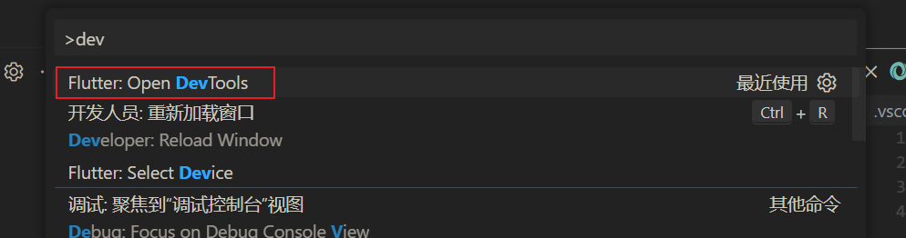


> 选择 `web browser`

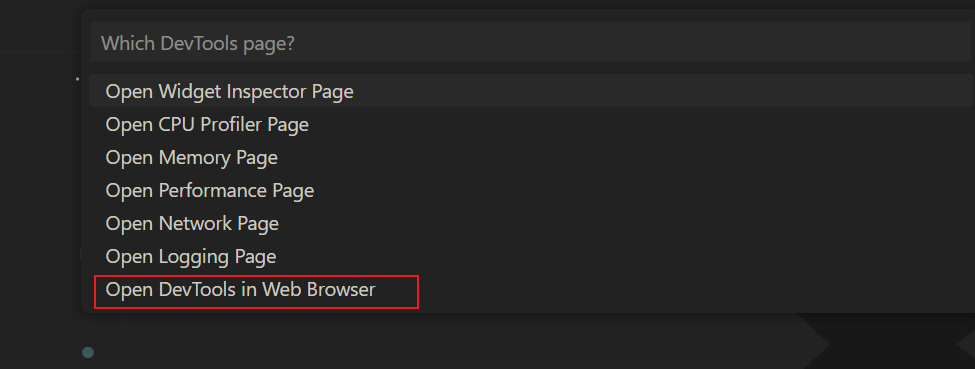

> 调试窗口

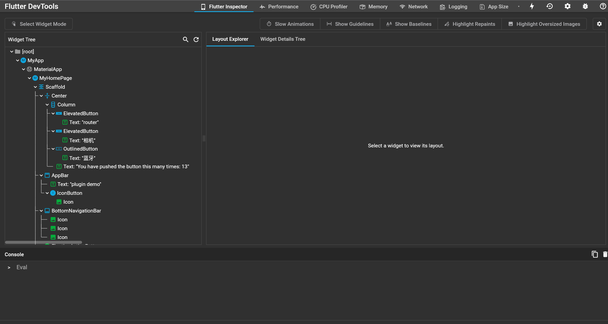


> [flutter inspecter](https://flutter.cn/docs/development/tools/devtools/inspector): 用于可视化和查看 widget 树

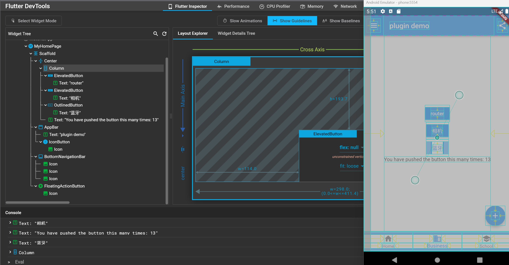


> Network

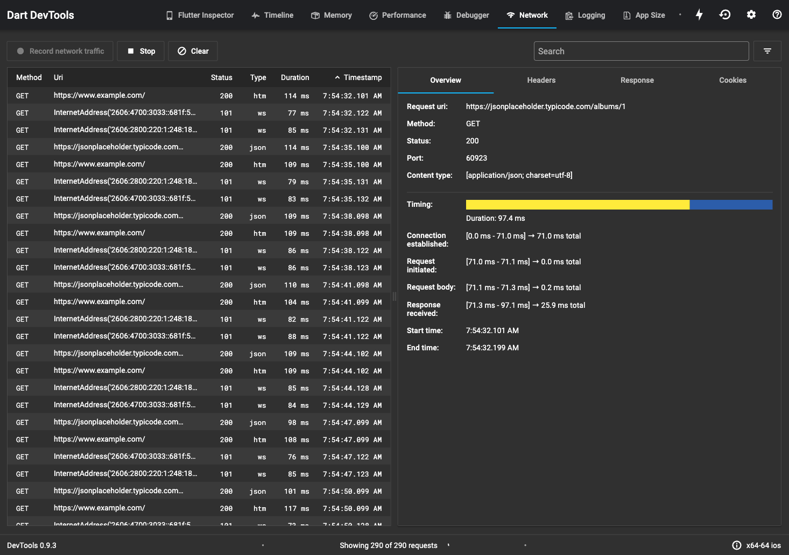


> Logging: 日志视图展示 Dart 运行时和应用框架（比如 Flutter）的事件，以及应用级日志。
>
> - Dart 运行时的垃圾回收事件
> - Flutter 框架事件，比如创建帧的事件
> - 应用的 `stdout` 和 `stderr` 输出
> - 应用的自定义日志事件

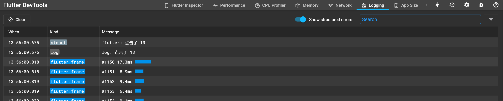


> App Size

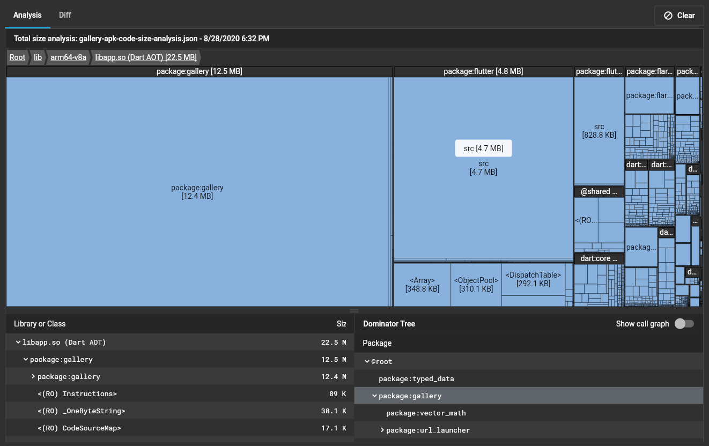

---

### 性能调试

> 开启 `profile`,`Performance`,`CPU Profiler`,`Memory`调试时需要用到 
>
> profile模式，需要真机，不支持模拟器，非性能调优，可忽略

* .vscode/launch.json

```json
    {
      "name": "sdk_demo (profile mode)",
      "request": "launch",
      "type": "dart",
      "flutterMode": "profile"
    },
```

> 加入测试代码

```dart
  void testFor() {
    for (var i = 0; i < 1000; i++) {
      print("for: $i");
    }
  }

@override
Widget build(BuildContext context) {
    testFor();
```

> 为了方便排查 可以设置过滤 勾选这三个项目，剩下的就是你自己的函数

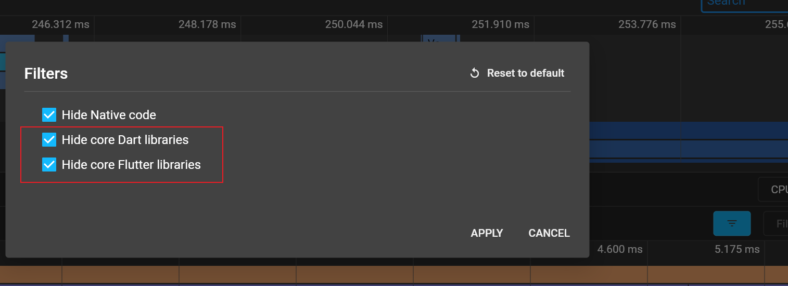

### Performance

> 页面渲染的流畅度

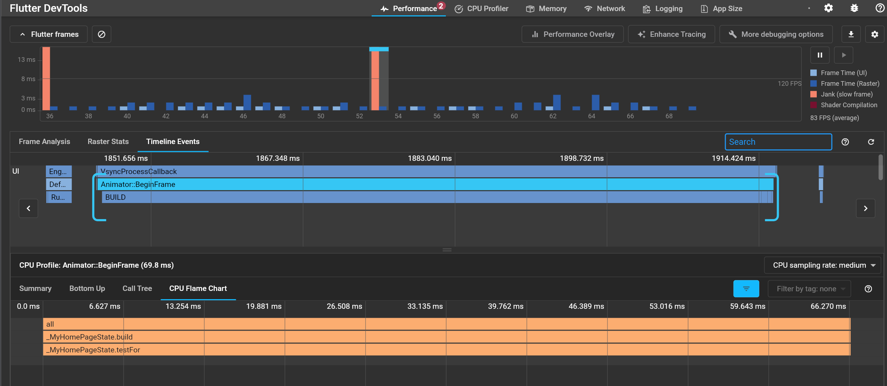


---

### CPU Profiler

> 用于检查代码的执行时间(即调用此方法整个的生命周期时长)

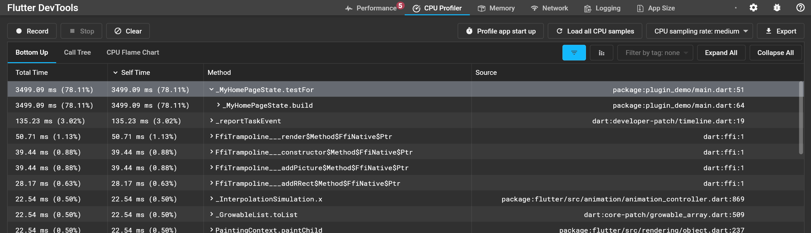


---

### Memory

> 内存视图提供了应用程序内存分配的详细信息，以及用于检测和调试特定问题的工具。

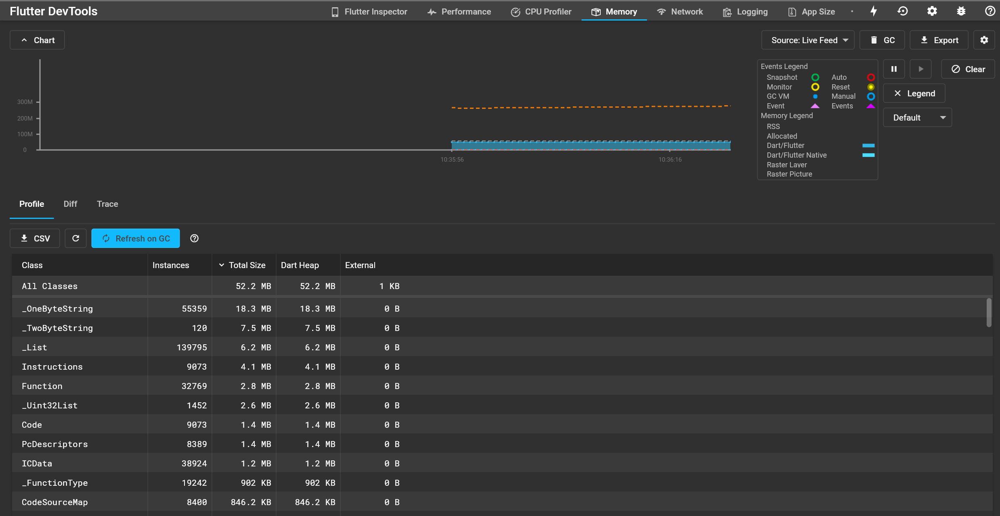


---

### App Size

> 导入 `apk体积文件`，生成可视化

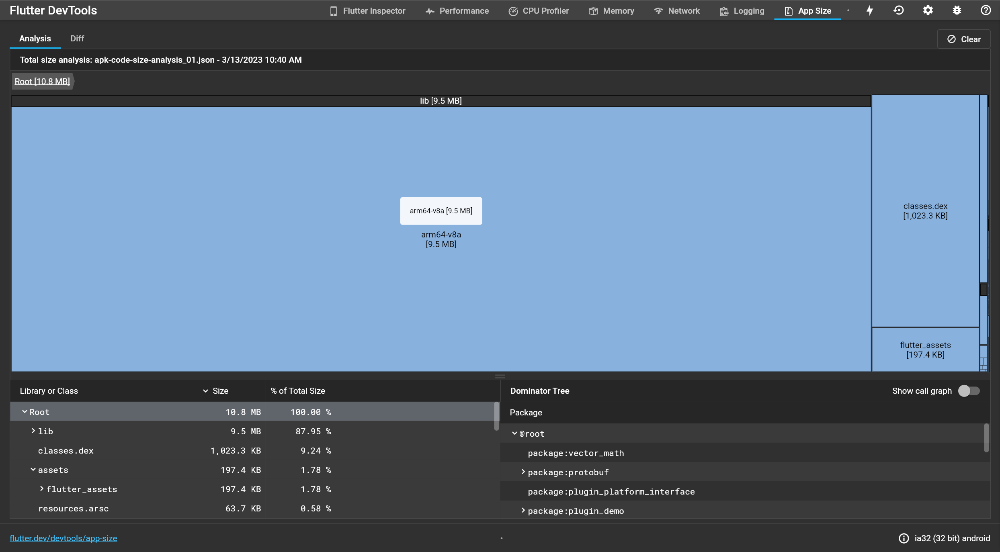


---

## 打包

### 创建安卓密钥证书

> keytool -genkey -v -keystore test-keystore.jks -storetype JKS -keyalg RSA -keysize 2048 -validity 10000 -alias test

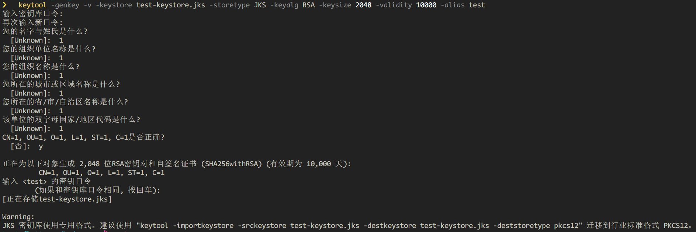


---

### 配置密钥证书

* 创建一个配置文件 `android/key.properties`

```properties
storePassword=<证书密码>
keyPassword=<证书密码>
keyAlias=test
storeFile=<密钥证书地址>
```

* `android/app/build.gradle`: 加载`key.properties`,把以下代码，加在 `android` 代码块前

```java
def keystoreProperties = new Properties()
def keystorePropertiesFile = rootProject.file('key.properties')
if (keystorePropertiesFile.exists()) {
     keystoreProperties.load(new FileInputStream(keystorePropertiesFile))
}

android {
    ...
}
```

* 修改 `buildTypes` 代码块

```java
buildTypes {
    release {
        // TODO: Add your own signing config for the release build.
        // Signing with the debug keys for now, so `flutter run --release` works.
        signingConfig signingConfigs.debug
    }
}
```

> 修改为

```java
signingConfigs {
    release {
        keyAlias keystoreProperties['keyAlias']
            keyPassword keystoreProperties['keyPassword']
            storeFile keystoreProperties['storeFile'] ? file(keystoreProperties['storeFile']) : null
            storePassword keystoreProperties['storePassword']
    }
}
buildTypes {
    release {
        signingConfig signingConfigs.release
    }
}
```


---

### 打包

> 运行 `flutter build`

```shell
flutter build apk
```

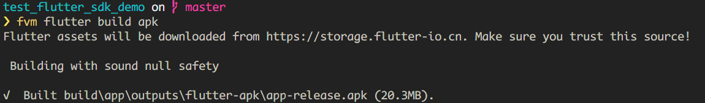

> 三种打包模式： `debug`、`profile`、`release`

```shell
flutter build apk --debug
```

> 修改打包参数`versionName`,`versionCode`
>
> 在`pubspec.yaml`,找到`version`,`1.0.0+1`,加号左侧为`versionName(1.0.0)`,加号右侧为`versionCode(1)`

* pubspec.yaml

```yaml
version: 2.0.0+20230313
```

* 对应的`local.properties`

```properties
flutter.versionName=2.0.0
flutter.versionCode=20230313
```

> 生成 `apk` 体积文件

```shell
flutter build apk --analyze-size --target-platform=android-arm64
```

